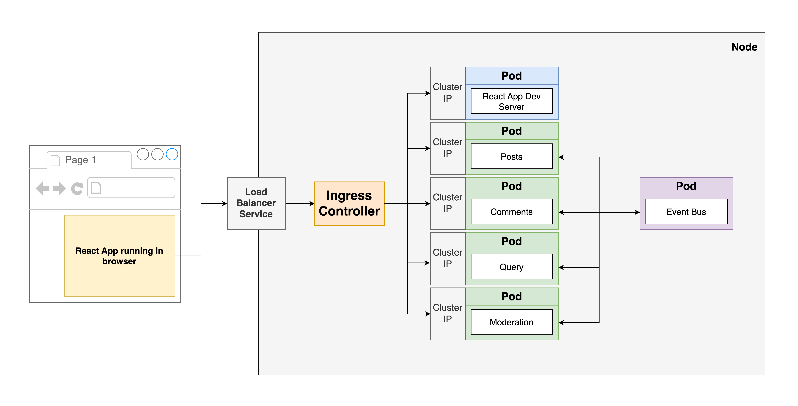

# Microservices Project

## Overview

This project is a microservices-based application using Node.js (v18+), Docker, Kubernetes with NGINX Ingress, and Skaffold for streamlined development and deployment workflows. Each microservice is containerized and orchestrated using Kubernetes.

## Prerequisites

-   Node.js v18 or newer
-   Docker
-   Kubernetes cluster (Minikube, kind, or any cloud Kubernetes service)
-   NGINX Ingress Controller installed in the Kubernetes cluster
-   Skaffold

## Setup

### Local Development

1. **Install Dependencies**
   Ensure you have Node.js, Docker, and Skaffold installed on your development machine. Also, set up a local Kubernetes cluster

    ```bash
    # Install Node.js dependencies
    npm install
    ```

1. **Using Skaffold**
   Skaffold can handle the workflow for building, pushing, and deploying your application. Once Skaffold is configured, you can start your application with the following command:

    ```bash
    # To Watch changes
    skaffold dev
    ```

## Architecture


